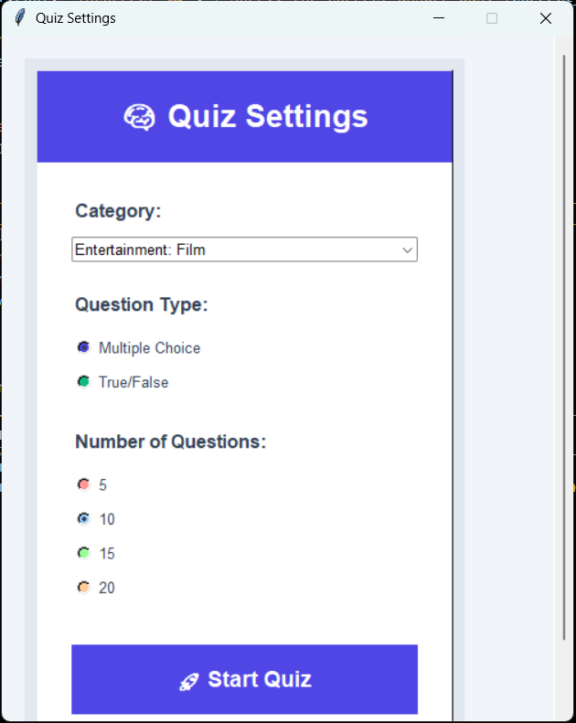
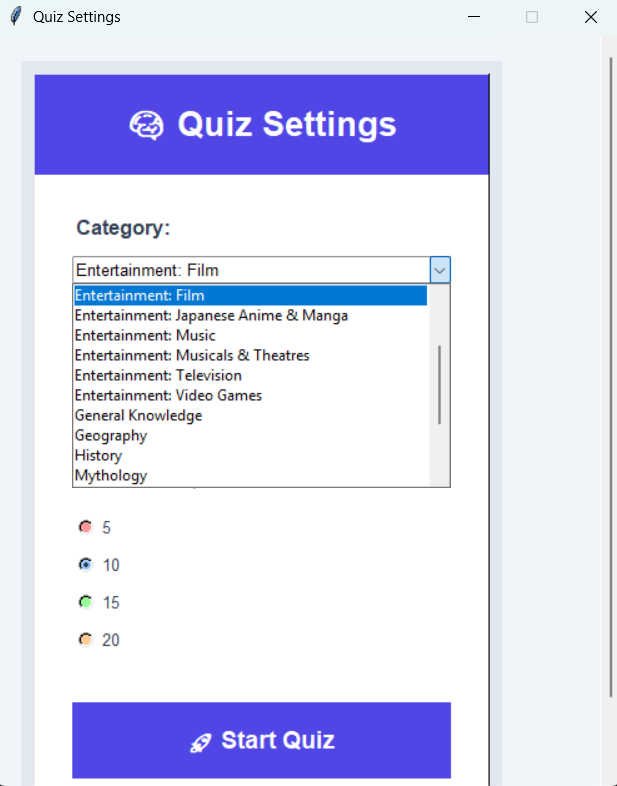
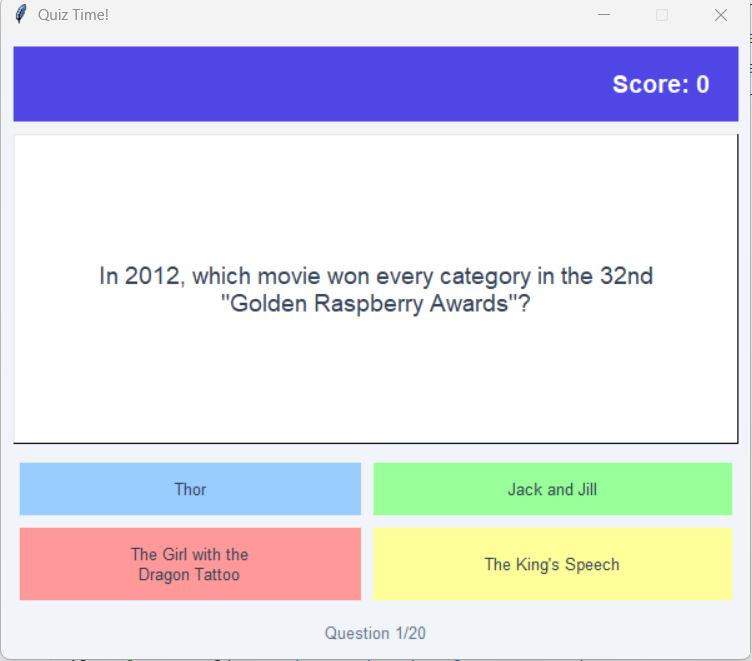
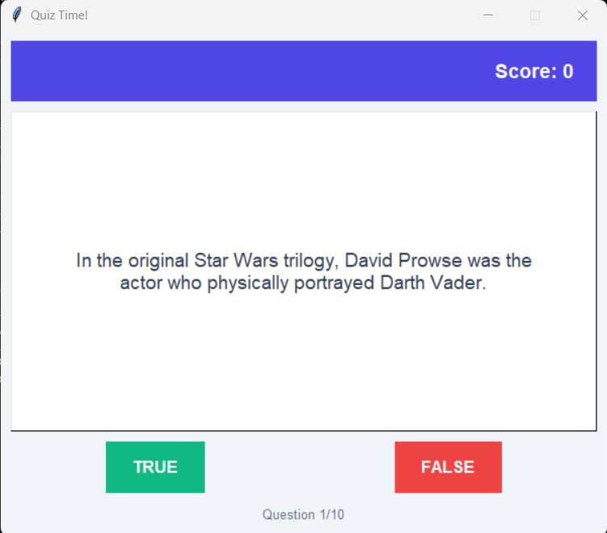
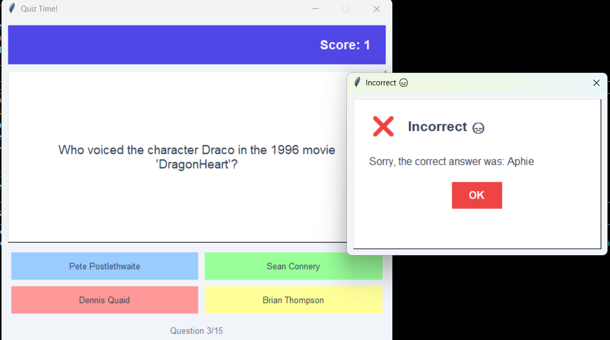

# 🧠 QuizMaster-Tkinter

A modern and visually appealing quiz application built with [Tkinter](https://docs.python.org/3/library/tkinter.html) and powered by the [Open Trivia Database](https://opentdb.com/).  
Users can customize quiz categories, question types, and number of questions — then enjoy an interactive quiz experience with real-time scoring and performance feedback.

---

## ✨ Features

- 🎨 **Modern UI** — Beautiful color scheme and clean layout
- ⚙️ **Configurable Settings** — Choose category, question type (Multiple or True/False), and number of questions
- 🧠 **Live Trivia Questions** — Fetched dynamically from the [Open Trivia Database](https://opentdb.com/)
- 💬 **Interactive Feedback** — Custom modal dialogs for correct/incorrect answers
- 📊 **Real-time Score Tracking** — Score updates instantly with progress display
- 📈 **Result Summary** — Shows your score, percentage, and motivational message
- 🔁 **Restart Option** — Quickly start a new quiz from the results screen

---

## 🖼 Screenshots

### 📍 Quiz Settings Window


### 📍 Quiz Categories Window


### 📍 Multiple Choice Question


### 📍 True/False Question


### 📍 Answer Feedback Modal


### 📍 Final Results Screen


---

## 🚀 Getting Started

### 🧩 Prerequisites
- [Python 3.x](https://www.python.org/downloads/)
- Internet connection (to fetch trivia questions)

### ⚙️ Installation

```bash
# Clone this repository
git clone https://github.com/<your-username>/QuizMaster-Tkinter.git

cd QuizMaster-Tkinter

# (Optional) Install dependencies
pip install requests

# Run the app
python main.py

---

## 🛠 Built With
Tkinter
 — GUI framework
Open Trivia Database
 — Trivia API

---
## 💡 Author
Created with ❤️ by jay Mondal
